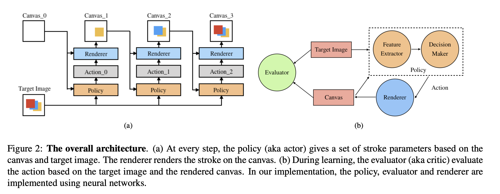
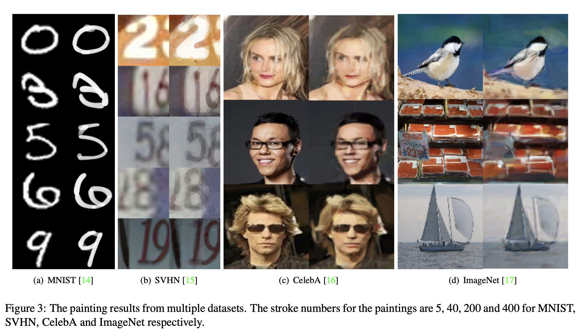

# Learning to Paint with Model-based Deep Reinforcement Learning

---> https://arxiv.org/abs/1903.04411

## Abstract

We show how to teach machines to paint like human painters, who can use a few strokes to create fantastic paintings. By combining the neural renderer and model-based Deep Reinforcement Learning (DRL), our agent can decompose texture-rich images into strokes and make long-term plans. For each stroke, the agent directly determines the position and color of the stroke. Excellent visual effect can be achieved using hundreds of strokes. The training process does not require experience of human painting or stroke tracking data. 

<div align=center>

</div>



## Installation
Use [anaconda](https://conda.io/miniconda.html) to manage environment

```
$ conda create -n py36 python=3.6
$ source activate py36
```

### Dependencies
* [PyTorch](http://pytorch.org/) 0.4 
* [tensorboardX](https://github.com/lanpa/tensorboard-pytorch/tree/master/tensorboardX)
* [opencv-python](https://pypi.org/project/opencv-python/)

### Datasets
Download the [CelebA](http://mmlab.ie.cuhk.edu.hk/projects/CelebA.html) dataset and put the aligned images in data/img_align_celeba/\*\*\*\*\*\*.jpg

## Training

### Neural Renderer
To create a differentiable painting environment, we need train the neural renderer firstly. 

```
$ python3 baseline/train_renderer.py
$ tensorboard --logdir train_log --port=6006
(The training process will be shown at http://127.0.0.1:6006)
```

### Paint Agent
After the neural renderer looks good enough, we can begin training the agent.
```
$ python3 baseline/train.py --max_step=40 --debug --batch_size=96
(A step contains 5 strokes in default.)
$ tensorboard --logdir train_log --port=6006
```

We will provide you some trained parameters soon. 
## Results



If you find this repository useful for your research, please cite the following paper:

```
@article{huang2019learning,
  title={Learning to Paint with Model-based Deep Reinforcement Learning},
  author={Huang, Zhewei and Heng, Wen and Zhou, Shuchang},
  journal={arXiv preprint arXiv:1903.04411},
  year={2019}
}
```
